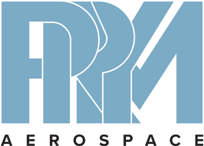

# Motor Control System

A sophisticated motor control and monitoring system with real-time gyroscope data visualization, encoder feedback, and advanced motor control capabilities.



## Features

- **Real-time Motor Control**: Control up to three motors simultaneously with precise position and velocity control
- **Gyroscope Integration**: Live monitoring of pitch, roll, and yaw angles
- **Encoder Feedback**: Real-time position and velocity feedback from motor encoders
- **Artificial Horizon Display**: Visual representation of orientation data
- **Advanced Data Visualization**: Real-time plotting of motor parameters and sensor data
- **Data Logging**: Save sensor and motor data to CSV files for analysis
- **Configurable Settings**: Adjustable torque limits, positions, and velocities
- **User-friendly Interface**: Modern, intuitive GUI with customizable controls
- **COM Port Management**: Easy connection and management of serial communications

## Installation

### Prerequisites

- Python 3.7 or higher
- Windows 10/11 operating system
- USB port for sensor connection

### Method 1: Using the Installer

1. Download the latest release of `MotorControlSystem.exe`
2. Run the installer and follow the on-screen instructions
3. Launch the application from the Start menu or desktop shortcut

### Method 2: From Source

1. Clone the repository
2. Create a virtual environment:
   ```bash
   python -m venv .venv
   .venv\Scripts\activate
   ```
3. Install dependencies:
   ```bash
   pip install -r requirements/requirements.txt
   ```
4. Run the application:
   ```bash
   python main.py
   ```

## Usage

1. **Connect Hardware**:
   - Connect your gyroscope sensor to an available COM port
   - Connect motor controllers as needed

2. **Launch Application**:
   - Start the Motor Control System application
   - Select the appropriate COM port from the dropdown menu
   - Click "Connect" to establish communication

3. **Control Motors**:
   - Use the position and velocity controls for each motor
   - Set torque limits as needed
   - Use the "Sync" buttons to synchronize multiple motors

4. **Monitor Data**:
   - View real-time plots of motor parameters
   - Monitor the artificial horizon display
   - Track encoder positions and velocities

5. **Data Logging**:
   - Click "Save Data" to export current session data
   - Data is saved in CSV format with timestamp

## System Architecture

- `main.py`: Main application and GUI implementation
- `sensor_interface.py`: Gyroscope sensor communication interface
- `fft_processor.py`: Signal processing and analysis
- `motor_control.spec`: Build specification for executable
- `setup.py`: Package configuration and dependencies

## Contributing

1. Fork the repository
2. Create a feature branch
3. Commit your changes
4. Push to the branch
5. Create a Pull Request

## License

This project is proprietary software. All rights reserved.

## Support

For technical support or questions, please contact the development team.

## Acknowledgments

- PyQt5 for the GUI framework
- pyqtgraph for real-time plotting
- pyserial for serial communication

---

Built with ❤️ by the Motor Control System Team 